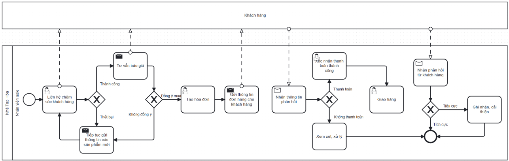

# CRM / Customer Care Process

## Actors

- Sales Staff
- Customer
- Staff

## Process flow

1. Sales Staff contacts customers by phone/email with product or promotion information.
2. Customer provides feedback/interest information.
3. Sales Staff evaluates the feedback.
4. If not progressing, Sales Staff may continue product communication and loop to customer contact.
5. The report documents order/invoice-related steps when the customer confirms.
6. Sales Staff receives payment confirmation or non-payment information.
7. Successful payment is confirmed; otherwise the documented flow can cancel the order.
8. Goods are packed/delivered.
9. Sales Staff receives post-sale feedback.
10. Staff records issues and improvement proposals.
11. In Odoo CRM, an opportunity is created and may move New → Consulting → Qualified based on documented conditions.
12. From the opportunity, a quotation can be created, emailed, confirmed to order, cancelled, or restored as documented.

## Documented exceptions / decision paths

- Quotation cancelled when customer declines.
- Cancelled quotation can be restored to quotation status in the documented Odoo flow.

## BPMN

  

