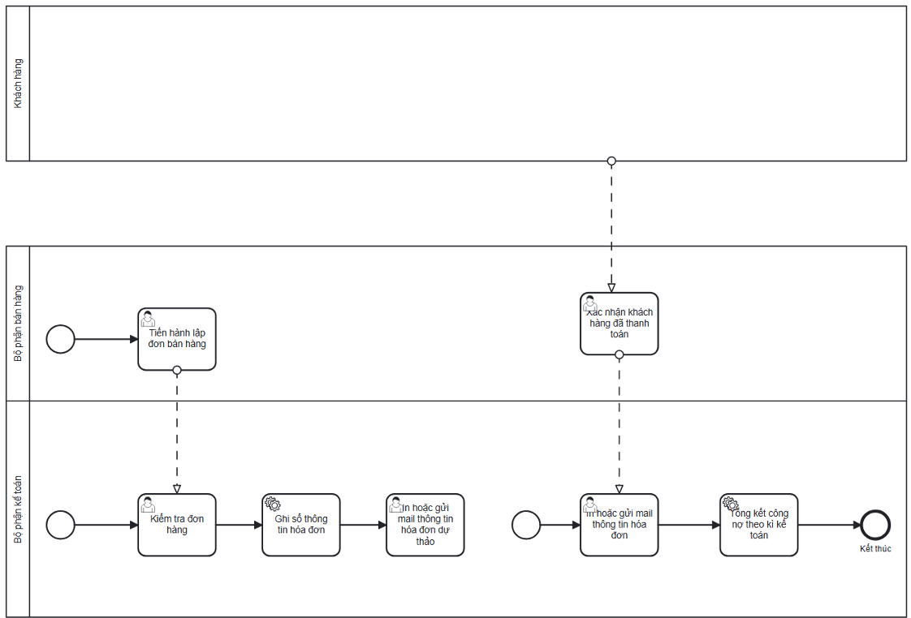

# Customer Receivables Process

## Actors

- Sales Staff
- Accountant

## Process flow

1. Sales Staff creates the customer sales order.
2. Accounting checks order/invoice information.
3. Accounting posts invoice information.
4. Accounting prints/emails the draft invoice.
5. Sales Staff confirms received customer payment to Accounting.
6. Accounting sends the confirmed paid invoice.
7. Accounting updates/summarizes receivables by period.

## Documented exceptions / decision paths

- No separate exception beyond the documented main flow was extracted for this summary.

## BPMN

  

