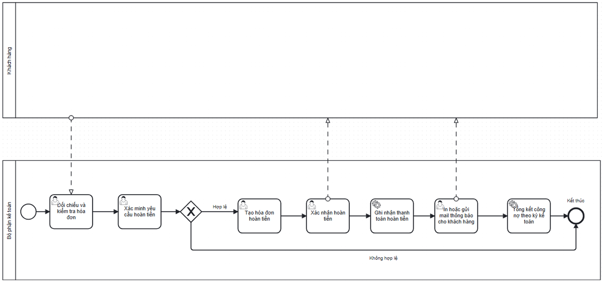

# Customer Refund Process

## Actors

- Accountant

## Process flow

1. Accounting checks order/invoice context.
2. Accounting validates the customer refund request.
3. Invalid requests are rejected; valid requests proceed.
4. Accounting creates a Credit Note linked to the original invoice.
5. Accounting reviews/approves the refund.
6. Accounting records the refund payment.
7. Accounting emails the customer that the refund was completed.
8. Accounting updates/summarizes receivables.

## Documented exceptions / decision paths

- Documented reasons include defective/nonconforming products, invoice value/tax/discount errors, transaction cancellation, and promotion/price adjustment.

## BPMN

  

