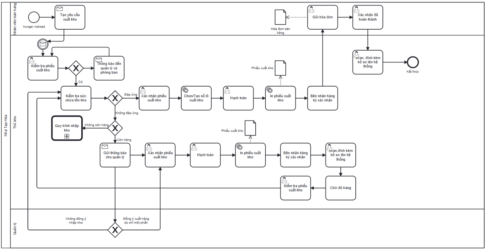

# Goods Issue / Outbound Process

## Actors

- Warehouse Staff
- Manager
- Requesting Department

## Process flow

1. Warehouse Staff reviews the stock-issue request.
2. Warehouse Staff/Manager checks stock available for products in the sales order.
3. Warehouse Staff confirms the stock-issue document.
4. Warehouse Staff performs the stock issue.
5. Warehouse Staff creates an outbound lot and records the transportation/issue process.
6. Stock-issue documentation is printed/shared as documented.
7. Related documents can be scanned and attached.
8. The report documents creation of an invoice for the receiving party to retain information.

## Documented exceptions / decision paths

- No separate exception beyond the documented main flow was extracted for this summary.

## BPMN

  

