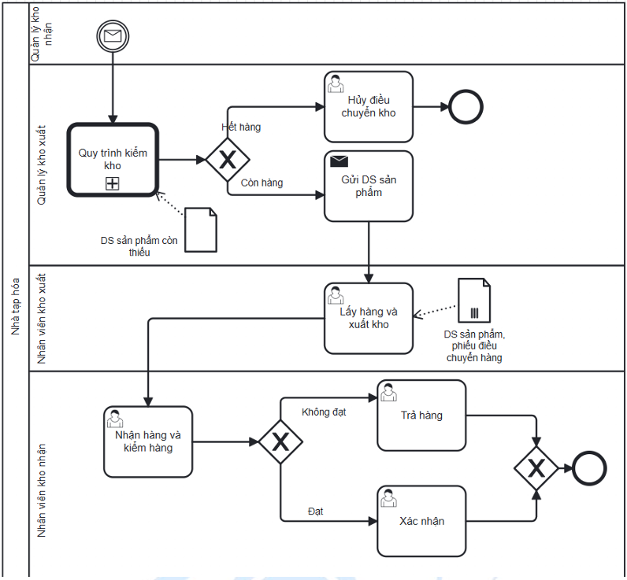

# Internal Stock Transfer Process

## Actors

- Receiving Warehouse Manager
- Source Warehouse Manager

## Process flow

1. Receiving Warehouse Manager sends a shortage email/list to the source warehouse.
2. Source Warehouse Manager performs stock checking.
3. If the source warehouse is out of stock, the transfer is cancelled.
4. If stock exists, the source warehouse sends the product list for issue.
5. Source warehouse picks goods, issues stock, and creates the stock-issue record.
6. Receiving warehouse receives and inspects goods.
7. If goods do not meet requirements, they are returned.
8. If goods meet requirements, the receiving warehouse confirms the transfer.

## Documented exceptions / decision paths

- Cancel if source stock is unavailable.
- Return transferred goods when they do not meet requirements.

## BPMN

  

