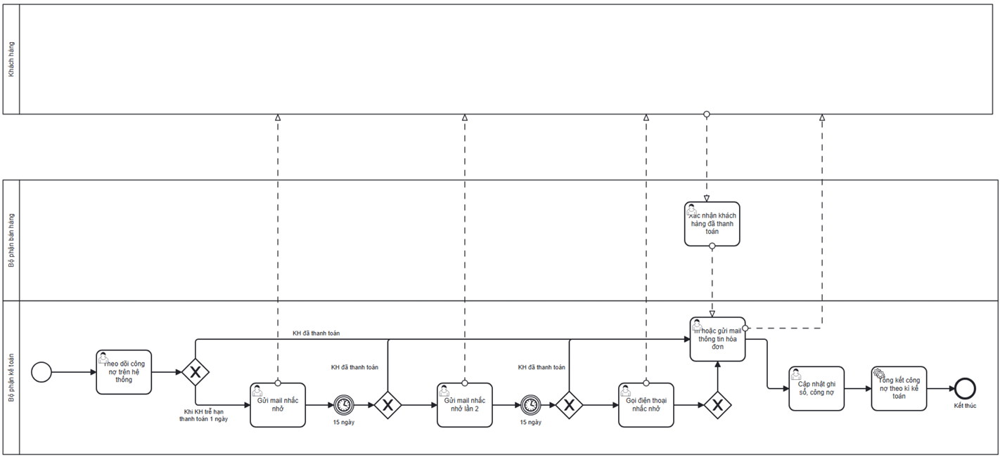

# Overdue Customer Receivables Process

## Actors

- Accountant
- Sales Staff

## Process flow

1. Accounting monitors customer receivables.
2. Accounting reviews unpaid invoices.
3. Accounting sends a payment reminder email.
4. At 15 days overdue, Accounting sends another reminder email.
5. For invoices unpaid more than 30 days, Accounting calls the customer.
6. When payment is received, Sales Staff confirms payment to Accounting.

## Documented exceptions / decision paths

- 15-day second email reminder.
- More-than-30-day phone reminder.

## BPMN

  

