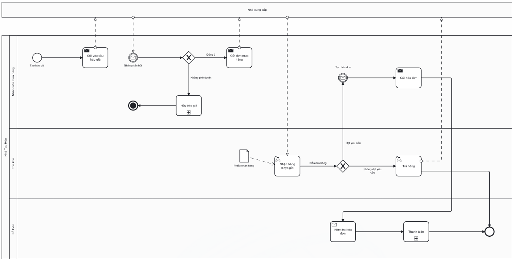

# Purchasing Process

## Actors

- Purchasing Staff
- Warehouse Staff
- Accountant
- Supplier

## Process flow

1. Purchasing Staff creates an RFQ.
2. Purchasing Staff sends the RFQ to the supplier.
3. Purchasing Staff receives the supplier response.
4. Purchasing Staff confirms or cancels the order.
5. Purchasing Staff sends the purchase order.
6. Warehouse Staff receives the goods.
7. Warehouse Staff checks quantity and quality.
8. Warehouse Staff passes the supplier invoice to purchasing.
9. Purchasing Staff checks/confirms the invoice.
10. Purchasing Staff sends the invoice to Accounting.
11. Accounting verifies invoice information.
12. Accounting pays the supplier invoice.

## Documented exceptions / decision paths

- RFQ cancellation when there is no longer a purchasing need.
- Purchase-order cancellation when the order was placed incorrectly/excessively or is no longer needed.

## BPMN

  

