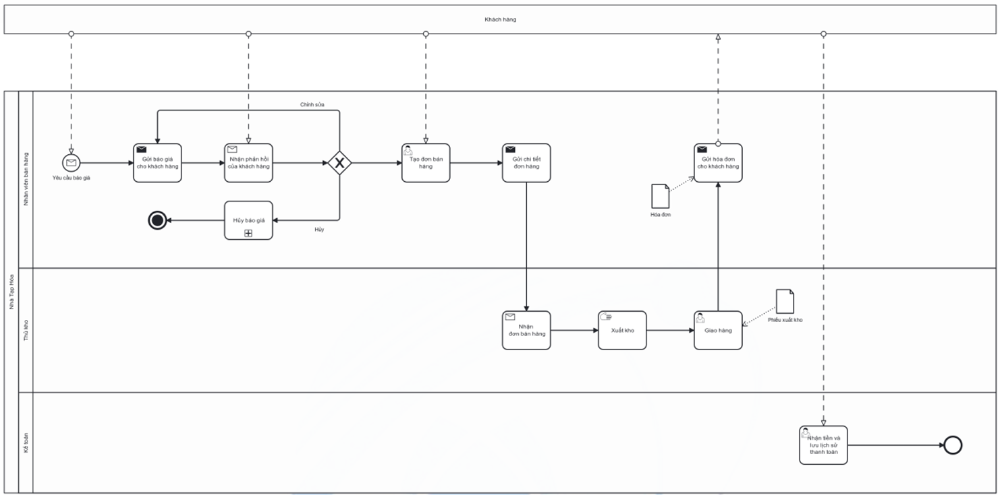

# Sales Process

## Actors

- Customer
- Sales Staff
- Warehouse Staff
- Accountant

## Process flow

1. Sales Staff receives a quotation request from the customer.
2. Sales Staff prepares and sends the quotation.
3. Sales Staff receives customer feedback; the customer may buy, decline, or request quotation changes.
4. Customer confirms the quotation when proceeding.
5. Sales Staff creates the sales order (the source description contains a wording inconsistency; see quality notes).
6. Warehouse Staff receives order details.
7. Warehouse Staff picks products according to the order.
8. Warehouse Staff delivers goods to the customer.
9. Sales Staff creates/sends the invoice.
10. Accounting receives/records payment and payment history.

## Documented exceptions / decision paths

- Quotation cancellation when the customer does not agree to buy.
- Confirmed-order cancellation is documented in the Odoo simulation.

## BPMN

  

