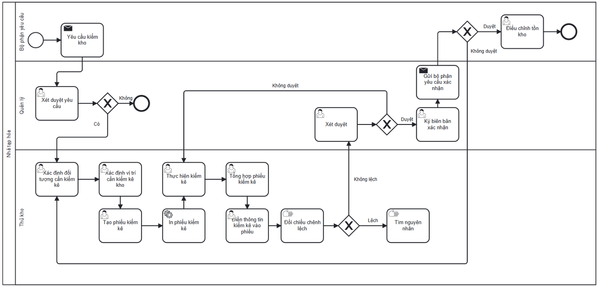

# Stock Count Process

## Actors

- Requesting Department
- Manager
- Warehouse Staff

## Process flow

1. Requesting Department requests a stock count.
2. Manager reviews/approves the request.
3. Warehouse Staff identifies the count target.
4. Warehouse Staff identifies the stock location.
5. Warehouse Staff creates and prints the count document.
6. Warehouse Staff performs the count and consolidates results.
7. Warehouse Staff records count information.
8. Warehouse Staff compares physical stock against system stock.
9. If variance exists, Warehouse Staff investigates the cause.
10. Manager reviews the variance.
11. If not approved, Warehouse Staff repeats the count.
12. If approved, Manager signs confirmation and sends results to the requesting department.
13. If the requesting department does not approve, the flow returns to identify/count again.
14. After approval, the requesting department adjusts stock to actual conditions.

## Documented exceptions / decision paths

- Recount loop when variance is not approved.
- Rework loop when the requesting department does not approve.

## BPMN

  

