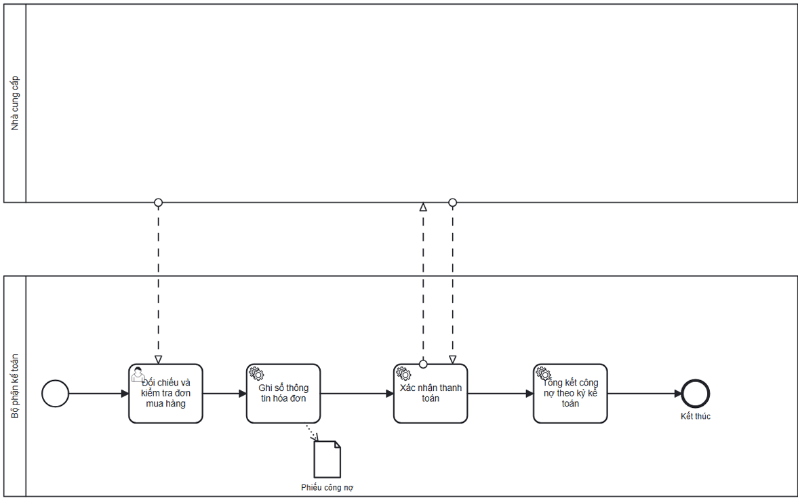

# Supplier Payables Process

## Actors

- Accountant

## Process flow

1. Accounting reconciles received goods and purchase order.
2. Accounting posts supplier invoice information.
3. Accounting pays the payable.
4. Accounting confirms invoice payment.
5. Accounting updates/summarizes supplier debt by period.

## Documented exceptions / decision paths

- No separate exception beyond the documented main flow was extracted for this summary.

## BPMN

  

