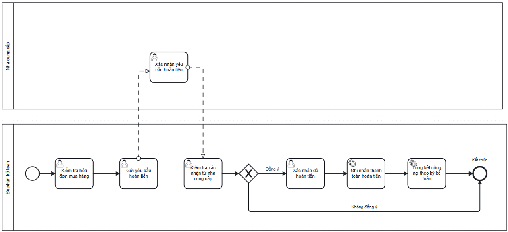

# Supplier Refund Process

## Actors

- Accountant
- Supplier

## Process flow

1. Accounting checks the purchase invoice/order.
2. Accounting sends a refund request to the supplier.
3. Supplier checks the invoice/request and responds.
4. Accounting rejects invalid cases or proceeds with valid cases.
5. Accounting creates/approves a Credit Note linked to the original vendor bill.
6. Accounting records the supplier refund payment.
7. Accounting updates/summarizes supplier debt.

## Documented exceptions / decision paths

- The report documents supplier refund cases such as damaged/nonconforming goods and invoice value/tax/discount errors; additional examples are listed in §3.6.5.3.

## BPMN

  

